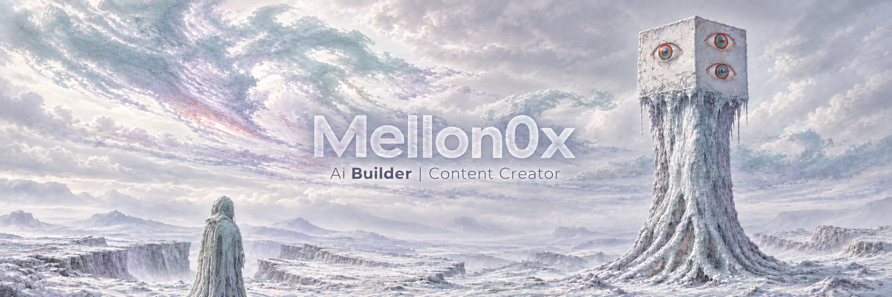
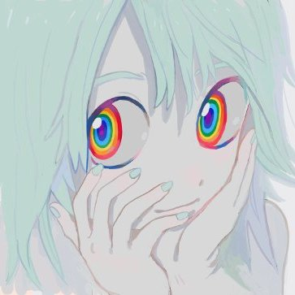

<p align="center">
  
</p>

<p align="center">
  
</p>

<h1 align="center">Mellon0x</h1>

<p align="center">
  <strong>Builder · Content Creator · Tools & Automation · Dev</strong>
</p>

<p align="center">
  I build useful things with code, AI and good taste — then turn the process into content worth sharing.
</p>

<p align="center">
  <a href="https://github.com/Mellon0x?tab=repositories"></a>
  
</p>

---

## `//` What I do

```text
I make tools, automation and developer workflows.
I create content around building in public, AI and the systems behind it.
I care about ideas that are useful, clear and a little unexpected.
```

<table>
  <tr>
    <td width="33%" align="center">
      <h3>🛠️ Build</h3>
      AI-powered tools<br />
      automation<br />
      developer workflows
    </td>
    <td width="33%" align="center">
      <h3>✦ Create</h3>
      content systems<br />
      visual experiments<br />
      ideas in public
    </td>
    <td width="33%" align="center">
      <h3>⌁ Iterate</h3>
      prototypes<br />
      feedback loops<br />
      shipping over theory
    </td>
  </tr>
</table>

## `//` Toolbelt

<p>
  
  
  
  
  
</p>

## `//` Building in public

> I’m interested in the overlap of code, creative direction and systems that make ideas easier to ship.

- Tools that remove friction from creative work
- Automation that makes small teams move faster
- Experiments with AI, interfaces and content

<p align="center">
  
</p>

<p align="center">
  <sub>Made in an ice-blue world — with one small spectrum glitch.</sub>
</p>
